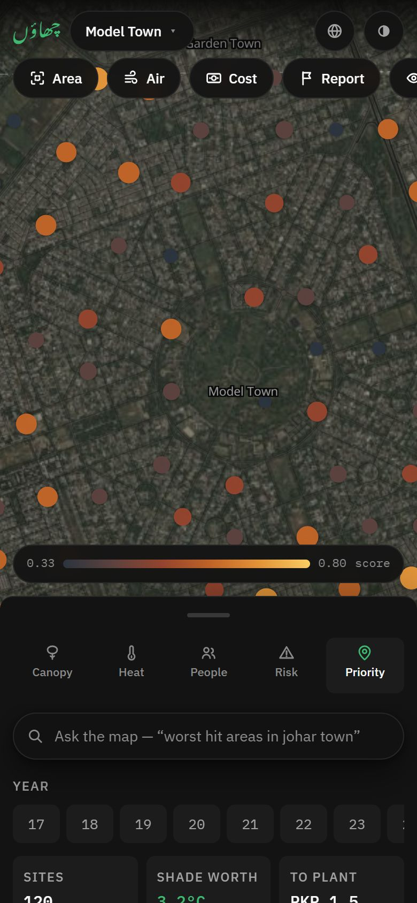
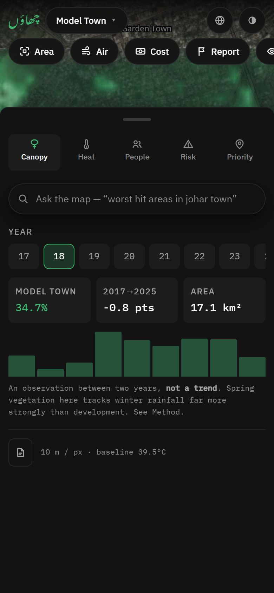
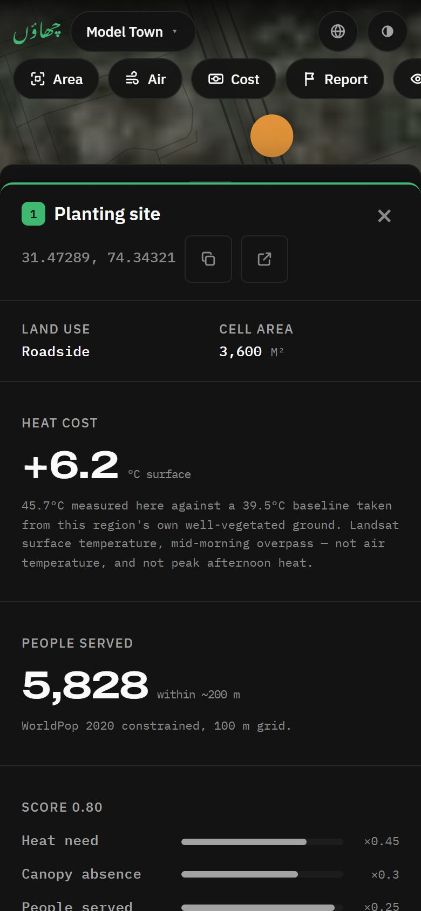

<div align="center">

# چھاؤں &nbsp;Chhaon

**Urdu for shade.**

Chhaon measures where Lahore's shade is missing, prices it in degrees of surface
heat, and ranks the ground worth planting — with a species chosen for each site.

Built for **Smart City Hackathon Lahore 2026** · Theme Two: City Intelligence

</div>

---

## The finding

> ### In Lahore, shade is worth 3.2 °C.

Bare ground in Model Town runs **3.2 °C hotter at the surface** than
well-vegetated ground **in the same satellite pass** — a correlation of
**−0.65** across 4,680 measured cells.

That is a within-scene comparison: same day, same sensor, same atmosphere. It
needs no trend, and it is what the entire priority map is built on.


| Region | Shade worth | NDVI ↔ heat | Baseline | Ranked sites |
|---|---|---|---|---|
| Model Town | **3.2 °C** | −0.65 | 39.5 °C | 120 |
| Gulberg | **2.6 °C** | −0.51 | 40.2 °C | 120 |
| Iqbal Town | **2.3 °C** | −0.59 | 40.9 °C | 120 |
| Johar Town | **1.8 °C** | −0.37 | 41.2 °C | 120 |
| DHA | **0.9 °C** | −0.20 | 41.8 °C | 120 |

**DHA is the weak one and we do not hide it.** Its bounds reach into farmland,
which blurs the built-versus-vegetated contrast the measurement depends on.

---

## What we did *not* find

**We do not claim Lahore is losing its canopy.** We looked, and the data does not
support it. Model Town reads **35.5 %** vegetated in 2017 and **34.7 %** in 2025,
having swung between 23.8 % and 49.2 % in between. Spring vegetation in Punjab
tracks winter rainfall far more strongly than it tracks development.

That negative result is the **first thing on the Method screen**. It is the most
likely thing for a technical judge to attack, and stating it ourselves is what
makes the positive finding believable.

---

## The product

**600 ranked planting sites across five Lahore neighbourhoods.** Each one carries
its measured heat cost, the population it serves, an open score breakdown, and a
species matched to that site's conditions.

Click any site and every figure is traceable back to a named satellite scene.


### Five ways of seeing one neighbourhood

**Heat** — Landsat surface temperature, rendered as a continuous field so the
streets read *through* it.


**Canopy** — Sentinel-2 vegetation index. Look where the green lands: Model
Town's central park and its tree-lined avenues, visible in the photograph
underneath. The layer validates itself against the imagery.


**People** — WorldPop density, in ink rather than a third colour scale.


**Risk** — every cell classified Low / Medium / High / Critical from heat and
shade deficit. Model Town's leafy core reads Low; the industrial belt to the
south reads Critical. Discrete bands, because a department writes "High risk"
in a report and a gradient gives them nothing to write.


Light theme and the survey-sheet basemap are equally first-class.


### On a phone

Not the desktop layout shrunk. The rail and the vertical legend alone took
160&nbsp;px of a 390&nbsp;px phone and left 230&nbsp;px of map, with the ranked
list and readout hidden entirely. Mobile gets the layout map apps actually use:
a full-bleed map with a draggable bottom sheet.

<p>
  
  
  
</p>

The view switcher lives at the top of the sheet so it is reachable in both
states, the tools get thumb-height chips, the legend turns horizontal, and every
panel becomes a sheet. `node scripts/mobileshots.mjs` asserts no horizontal
overflow and no tap target under 34&nbsp;px.

### Catching change while it is still news

The yearly layers are locked to one spring window so 2017 and 2025 are
comparable. That is right for a trend and useless for news: if a stand of trees
comes down in July, the next comparable observation is nine months away.

Sentinel-2 revisits every ~5 days, so the observations already exist.
`pipeline/recent.py` is the fast half of the pipeline — it reuses the grid, reads
only passes it has not seen, and looks for cells that **were vegetated and
abruptly are not**.

The two analyses are never mixed. A single pass cannot carry a multi-year claim,
and a yearly composite cannot date an event.

**Smog season is stated, not hidden.** From November to February aerosol
depresses NDVI across the whole scene, so those passes would show loss
everywhere at once and recovery everywhere in March. They are kept in the record
and marked unusable with the reason — because a gap nobody explains looks like a
bug, and "we cannot see the ground in December" is itself worth knowing.

**A single observation is never trusted.** The first live run reported 17 events,
the largest 371&nbsp;ha — a quarter of Model Town. One pass had cleared the
coverage floor while reporting the region as 2.3&nbsp;% vegetated against a
38.6&nbsp;% median: thin haze passes the cloud mask and still depresses the
signal everywhere. So a pass whose whole scene collapses against its neighbours is
rejected as haze, and the "before" reading is the maximum over the three most
recent passes rather than a four-month seasonal envelope. After both: **2 events,
largest 2.2&nbsp;ha**, with the rejected pass carrying its own explanation.

**A drop is not a cause.** Felling, fire, harvest, construction clearance and a
mown lawn are indistinguishable from orbit. Every event says what changed and
when, never why.

The current run makes that concrete. The largest detected loss anywhere is
**53&nbsp;ha at DHA's north-eastern edge** — 148 contiguous cells going from NDVI
0.57 to 0.33 in a fortnight. That is a field being harvested, not trees coming
down: one coherent block, in the farmland DHA's bounds reach into. The detection
is correct and the cause is agricultural, which is precisely why the product
refuses to name causes and why a citizen report is what turns an event into a
finding.

### Watched areas

Draw a box and Chhaon answers a standing question: *has anything changed here?*

Built for the people who actually need it — a journalist watching one contested
plot, an NGO watching a green belt, someone assembling evidence for a petition.

The design constraint that mattered most was **not alerting on everything**. A
monitor that fires on every flicker is muted within a week, and a muted monitor
is worse than none because it looks like coverage. So a watch is one drawn area
rather than a region, it carries its own threshold (default: an NDVI drop of
0.15 over at least 3 contiguous cells, ~1.1 ha), and an alert can be
acknowledged so it stops competing with the next one.

**There is no push, and the panel says so.** This is a static site with no
server; watches are evaluated when you open it. Promising an email would be a
promise the architecture cannot keep.

### Citizen reports

A street tree is smaller than one satellite pixel. Felling one moves nothing we
measure — which is exactly why the product says "green cover, never tree
canopy". A person on the ground is the only way it enters the record.

Report a felled tree, a fire, dieback or a new planting, with a photo and a
geotag. One input serves both routes — a phone opens the rear camera, a laptop the
file picker — and photos are resized to 1280&nbsp;px and re-encoded, which drops
EXIF as a side effect.

**Two ways to place it, because they suit different moments.** Standing in front of
the tree, the phone already knows: *Use my current location* takes a GPS fix, flies
the camera to it, and shows the accuracy radius. From a desk, working off a
photograph, only the map does: tap the spot instead.

The accuracy radius is shown rather than swallowed, and it changes what the report
can claim. A fix wider than the 60&nbsp;m analysis cell says so; past
500&nbsp;m — which is what a laptop usually reports, being wifi-derived rather than
GPS — it says that is a neighbourhood, not a tree, and asks you to adjust it. A fix
outside Lahore is refused rather than pinned where the map cannot show it, and a
refused permission explains itself and leaves the map route open. How the
coordinate was obtained, and to what radius, is recorded in the log: it is
evidence, and evidence carries its provenance.

**Nothing claims the government was alerted.** There is no public API to file
against, and an email to the PHA is a message in an inbox, not a workflow.
Instead there are two clearly separated tiers:

| | |
|---|---|
| **The public log** | `public/data/reports.json`, committed — public, timestamped, auditable in git history |
| **Local drafts** | this browser only, labelled that way everywhere they appear |

Export produces a `reports.json` **already merged with the current public log**,
so committing it cannot drop anyone else's entries. For a complaint that gets a
tracking number, each report offers copyable text for the Pakistan Citizen
Portal — the route that does have a workflow behind it.

### Ask the map

Type `worst hit areas in johar town` and the region, the view and the filters
move. Type `گلبرگ میں گرمی` and the same thing happens.

It is a **deterministic phrase matcher, not a chatbot** — and that is the whole
design. It answers by moving the map, never by writing sentences, so there is no
mechanism by which it can state a figure nobody measured. Every output is an
existing piece of app state: one of five regions, one of five views, a year the
pipeline actually produced, a species that appears in the ranking.

Consequences, all of them in its favour here:

- **It cannot hallucinate.** There is nothing to hallucinate with.
- **It is auditable.** It shows what it matched *and what it ignored*, so you can
  see it was understood rather than guessed at.
- **Urdu costs almost nothing**, because setting a filter needs recognition, not
  generation.
- **It works offline**, like the rest of the product.

When it understands nothing it says so. Silently doing nothing is the one
genuinely bad outcome — you cannot tell that from a broken feature.

### The Method screen

Written to survive a technical judge reading it closely — limits first.


---

## The data is real

| Layer | Source | Native resolution |
|---|---|---|
| Green cover (NDVI) | Sentinel-2 L2A via Element 84 Earth Search | 10 m |
| Surface temperature | Landsat 8/9 C2 L2 via Microsoft Planetary Computer | 100 m |
| Plantable land | OpenStreetMap via Overpass (ODbL) | vector |
| Population | WorldPop 2020 constrained | 100 m |
| Basemap · Imagery | OpenFreeMap · Esri, Maxar | vector · raster |

**No API key is needed for any of it**, and the app makes **zero runtime API
calls** — everything is precomputed and committed, so nothing can time out during
a demo.

### It opens on 3G

First paint fetches three files. The core grid carries only the **latest** NDVI
year — the one the app defaults to and the one the risk layer needs — and the
earlier years become separate files, fetched when the scrubber asks and
prefetched once the map reports idle. On DHA, the worst case, that took first
paint from 144&nbsp;KB gzip to **53&nbsp;KB**.

The prefetch waits for MapLibre's `idle` event rather than `requestIdleCallback`,
which only knows the main thread is free and starts pulling years while the
basemap is still streaming — on a slow connection it competes with the map the
user is actually looking at.

Measured, not assumed: `node scripts/budget.mjs --3g` reports what is on the
critical path — **2.7&nbsp;s** to measurements on screen on the production build,
throttled to Fast 3G, repeatable across runs. `node scripts/progressive.mjs --3g`
fails if a year file ever lands before the first layer renders.

What remains on that path is the bundle, and it is mostly MapLibre — which is the
product, not overhead. The Method screen, the mobile shell and the two tool panels
are split out of it, so nothing downloads a surface you have not opened.

**No font request leaves the origin.** The four fonts are self-hosted, and Noto
Nastaliq Urdu is subsetted to the five letters of the wordmark — the only string in the app that uses it — taking it from
**233&nbsp;KB to 20&nbsp;KB**. `python scripts/fetch_fonts.py` regenerates them;
`scripts/features.mjs` measures the rendered wordmark and fails if it falls back
to a system face, because Nastaliq is a joining script and a bad subset would
look wrong while every other check still passed.

The basemap and the imagery are still third-party, deliberately — OpenFreeMap and
Esri are the whole reason there is no tile server to run. So the honest claim is
that **nothing but map tiles leaves the origin**, not that nothing does.

You can verify any figure yourself. Re-reading the raw scene at the top-ranked
site gives **45.8 °C** against the **45.7 °C** the app reports, and NDVI **0.13**
against **0.127**. Scenes: `LC08_L2SP_149038_20250604`, `S2C_43RDQ_20250401`.

---

## Three decisions worth knowing

**Scenes are anchored to a day-of-year, not to cloud cover.** Picking the
least-cloudy scene each year put 2020 on 2 April and 2021 on 3 March — a month
of spring drift moves NDVI more than a decade of development does.

**Each year is a multi-scene composite.** On nearly identical dates Model Town
read 34 % → 23 % → 8 % → 47 % across 2017–2020. That is haze, not tree loss.
Cloud and haze both *depress* NDVI, so a per-cell maximum rejects them. Coverage
is adaptive: we keep pulling scenes until it clears 92 %, and a year that never
does is **dropped** — a hole in the raster would read as "no trees" when it means
"no data".

**Species matching ignores climate, and we proved it had to.** NASA POWER returns
**byte-identical** temperature, wind and elevation for Model Town, Gulberg and
DHA — its grid is ~50 km. A climate-driven matcher would recommend the same tree
for every pin. Species are matched on land use, planting width and proximity to
water instead.

---

## Honest limits

- **"Green cover", never "tree canopy."** At 10 m/px a vegetated cell may be
  lawn, crop, scrub or canopy. We cannot count trees.
- **"Surface temperature", never "temperature."** It runs far hotter than air,
  and Landsat passes mid-morning — not the afternoon peak.
- **60 m cells.** A site marks a square worth surveying, not a hole to dig. We
  have not checked ownership or buried utilities.
- **The scoring weights are our judgment**, not a measurement. They are shown on
  every site so anyone can argue with them.
- **CO2 and PM2.5 are estimated**, from one published coefficient times mature
  crown area — not measured, not Lahore-specific, and they assume every tree
  reaches maturity.
- **A detected loss is not a cause.** Felling, fire, harvest, clearance and a mown
  lawn look identical from orbit. Pair an event with a citizen report to say what
  happened.
- **Watches do not notify.** No server, so nothing arrives while the tab is shut.
- **A citizen report is not a complaint.** It is a public timestamped record; the
  Citizen Portal is where a complaint gets a tracking number.
- **We cannot see the ground from November to February.** Smog-season passes are
  kept and marked unusable, never silently dropped.

---

## Run it

```bash
npm install
npm run dev          # http://localhost:5173
npm run build
```

Regenerate the data (slow; results are cached):

```bash
pip install rasterio pyproj shapely numpy
python pipeline/run.py              # all five regions — slow, the decade of yearly layers
python pipeline/run.py model-town   # just one
python pipeline/recent.py           # the fast rolling stage: recent passes and detected loss
python pipeline/split_years.py      # re-shape committed grids into core + per-year files
```

`run.py` is the slow half and rarely needs re-running. `recent.py` is the half
meant to run on a schedule — it reuses the grid `run.py` wrote, reads only passes
it has not seen, and is what keeps the Change panel current.

Its reads run six at a time, because they are HTTP range requests that spend
almost all their time waiting. Measured on Model Town: **124&nbsp;s serially,
53&nbsp;s at six** — and byte-identical output at 1, 6 and 12 jobs, so the
concurrency cannot change what is reported. `--jobs N` if you want more; the
default stays modest because this is a free catalogue run for everyone.

Verify:

```bash
python pipeline/test_logic.py      # scoring, species matching, compositing, change rules
python pipeline/qa.py              # data sanity across every region
node scripts/smoke.mjs             # map timing + rendered dot count
node scripts/progressive.mjs       # first paint stays small; the scrubber really repaints
node scripts/progressive.mjs --3g  # the same, throttled to Fast 3G
node scripts/budget.mjs --3g       # where the time goes before the map is usable
node scripts/features.mjs          # reporting, change detection, watches, text-to-filter
node scripts/mobileshots.mjs       # no overflow, no tap target under 34px
node scripts/docshots.mjs          # the images in this README
```

`test_logic.py` runs the change-detection rules on numpy alone, so the checks
that decide whether the product accuses anyone of felling trees take two seconds
rather than needing the geospatial stack and the network.

---

## Using it

| | |
|---|---|
| `/` | Ask the map — sets filters from a description |
| `1` – `5` | Canopy, Heat, People, Risk, Priority |
| `Q W E R T` | Jump between the five regions |
| `←` `→` | Step through years |
| `↑` `↓` | Walk the ranked sites |
| `Enter` | Zoom to the selected site |
| `A` | Select an area on the map |
| `C` | Cost |
| `G` | Air |
| `V` | Recent change and watched areas |
| `N` | Report a felled tree or fire |
| `L` | Show or hide the ranked list |
| `B` | Map or satellite |
| `D` | Light or dark |
| `M` | Method |
| `Esc` | Clear selection |

**Risk zones** classify every cell Low / Medium / High / Critical from heat and
shade deficit — the language a department writes reports in, not a gradient.
**Green cover** charts observed vegetated share by year, labelled an observation
rather than a trend. Each site carries an **estimated** CO2 and PM2.5 figure
once mature; all 600 together come to about 19 t CO2/year, roughly
4 cars' worth — honest, and modest, because urban planting at this
scale is a heat intervention rather than a carbon one.

Three tools sit on the main screen — **Select area**, **Air** and **Cost** —
because in a demo a feature nobody can find in five seconds may as well not
exist.

**Air** reports the particulate the recommended planting would capture. It does
**not** show an AQI reading, deliberately: no free source gives measured air
quality at neighbourhood scale, and Sentinel-5P's 5.5 km pixels would give every
region here the same number. The panel says so itself.

**Draw a box** anywhere to recompute cover, mean surface temperature
and population for just that area — a ward, a corridor, the blocks around a
school. The ranked list carries an **editable cost estimate** (default PKR 1,200
per tree including establishment care, weighted by species size) so a proposal
has a budget line and not just a map.

Exports: ranked sites as **CSV or GeoJSON**, and the measured layers themselves
as **grid GeoJSON or a georeferenced PNG + world file**, so a department's GIS
team can work in QGIS or ArcGIS rather than being locked into ours. Every site has copy-coordinates and an open-in-Google-Maps link. The URL
hash carries region, view, year, selected site, theme and basemap, so any view
can be sent to someone.

---

## Stack

MapLibre GL JS renders everything natively — basemap, interpolated data rasters
and vector sites alike. React, TypeScript, Vite, Zustand. Static deploy, no
backend.

There is no deck.gl: version 9.3's `MapboxOverlay` reads `map.transform`, which
MapLibre 5+ no longer exposes, so it throws on every frame.

---

## Docs

- **[`docs/PRODUCT.md`](docs/PRODUCT.md)** — the full team brief: every decision
  and its reasoning, the scoring model, all five regions, the limits to state
  before you are asked, and the bugs that cost us real time
- [`docs/SCREENS.md`](docs/SCREENS.md) — the surfaces and the single job each does
- [`pipeline/config.py`](pipeline/config.py) — regions, season windows, weights, species table

`.claude/skills/` carries three project skills — `chhaon-design-system`,
`map-ui`, `map-performance` — to be loaded before touching the code they cover.
