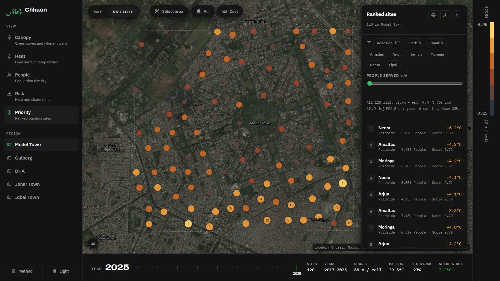
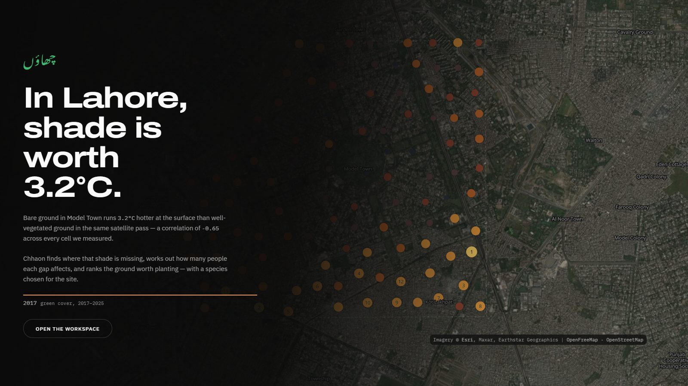
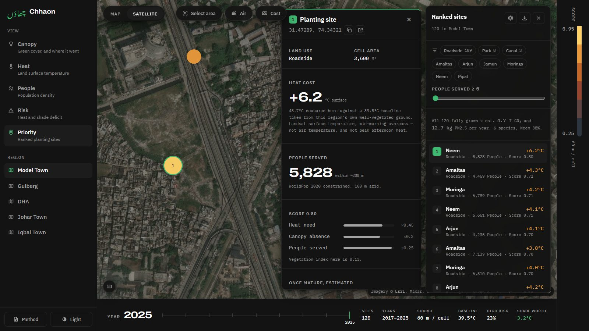
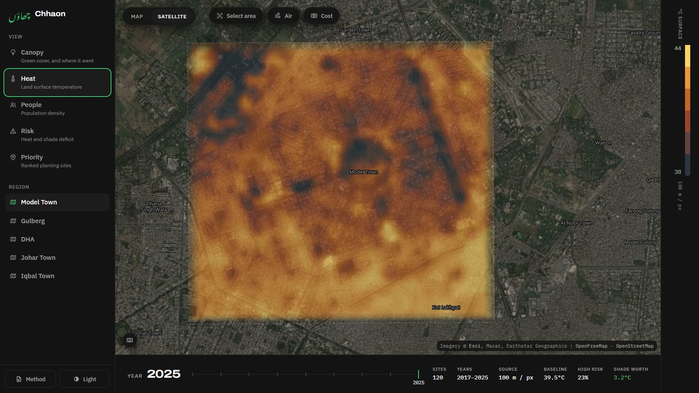
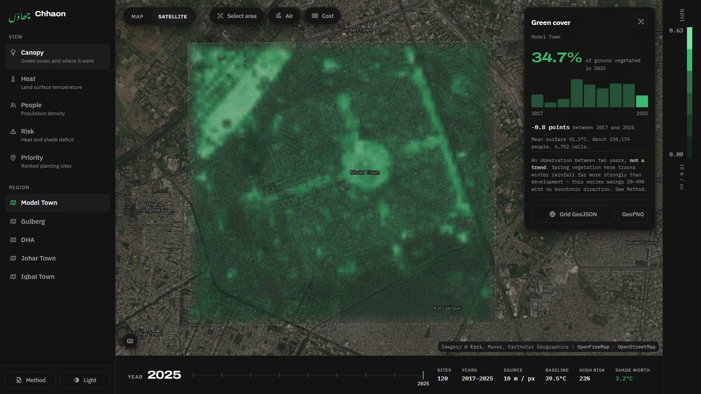
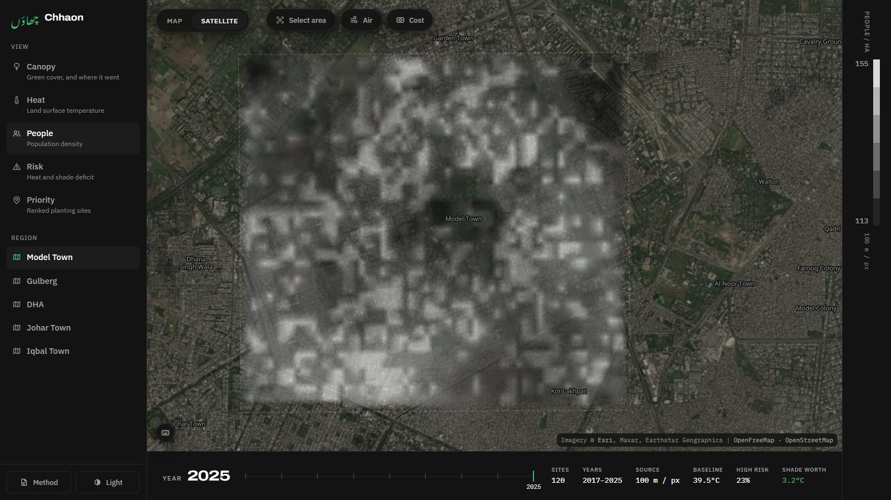
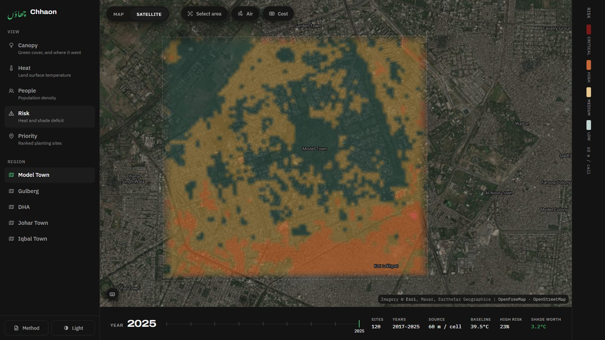
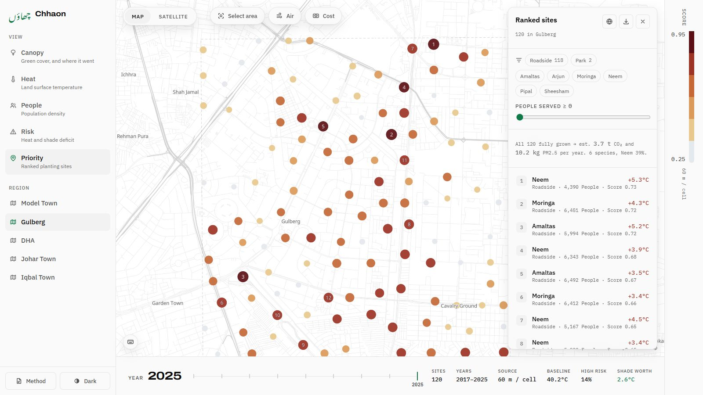
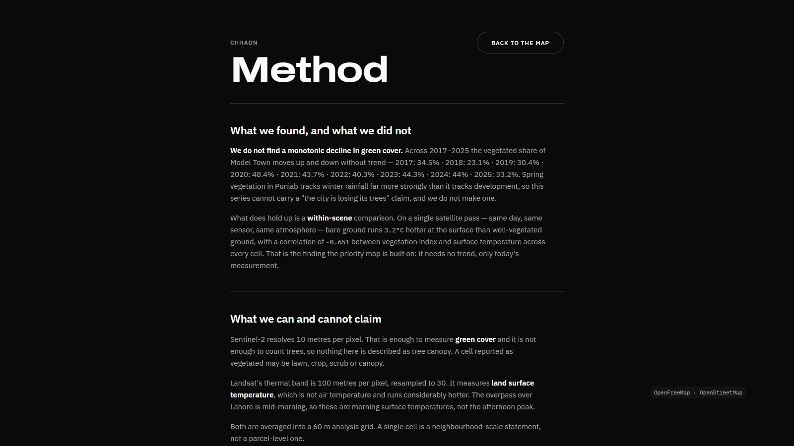

<div align="center">

# چھاؤں &nbsp;Chhaon

**Urdu for shade.**

Chhaon measures where Lahore's shade is missing, prices it in degrees of surface
heat, and ranks the ground worth planting — with a species chosen for each site.

Built for **Smart City Hackathon Lahore 2026** · Theme Two: City Intelligence

</div>

---

## The finding

> ### In Lahore, shade is worth 3.2 °C.

Bare ground in Model Town runs **3.2 °C hotter at the surface** than
well-vegetated ground **in the same satellite pass** — a correlation of
**−0.65** across 4,680 measured cells.

That is a within-scene comparison: same day, same sensor, same atmosphere. It
needs no trend, and it is what the entire priority map is built on.



| Region | Shade worth | NDVI ↔ heat | Baseline | Ranked sites |
|---|---|---|---|---|
| Model Town | **3.2 °C** | −0.65 | 39.5 °C | 120 |
| Gulberg | **2.6 °C** | −0.51 | 40.2 °C | 120 |
| Iqbal Town | **2.3 °C** | −0.59 | 40.9 °C | 120 |
| Johar Town | **1.8 °C** | −0.37 | 41.2 °C | 120 |
| DHA | **0.9 °C** | −0.20 | 41.8 °C | 120 |

**DHA is the weak one and we do not hide it.** Its bounds reach into farmland,
which blurs the built-versus-vegetated contrast the measurement depends on.

---

## What we did *not* find

**We do not claim Lahore is losing its canopy.** We looked, and the data does not
support it. Model Town reads **35.5 %** vegetated in 2017 and **34.7 %** in 2025,
having swung between 23.8 % and 49.2 % in between. Spring vegetation in Punjab
tracks winter rainfall far more strongly than it tracks development.

That negative result is the **first thing on the Method screen**. It is the most
likely thing for a technical judge to attack, and stating it ourselves is what
makes the positive finding believable.

---

## The product

**600 ranked planting sites across five Lahore neighbourhoods.** Each one carries
its measured heat cost, the population it serves, an open score breakdown, and a
species matched to that site's conditions.

Click any site and every figure is traceable back to a named satellite scene.



### Four ways of seeing one neighbourhood

**Heat** — Landsat surface temperature, rendered as a continuous field so the
streets read *through* it.



**Canopy** — Sentinel-2 vegetation index. Look where the green lands: Model
Town's central park and its tree-lined avenues, visible in the photograph
underneath. The layer validates itself against the imagery.



**People** — WorldPop density, in ink rather than a third colour scale.



**Risk** — every cell classified Low / Medium / High / Critical from heat and
shade deficit. Model Town's leafy core reads Low; the industrial belt to the
south reads Critical. Discrete bands, because a department writes "High risk"
in a report and a gradient gives them nothing to write.



Light theme and the survey-sheet basemap are equally first-class.



### The Method screen

Written to survive a technical judge reading it closely — limits first.



---

## The data is real

| Layer | Source | Native resolution |
|---|---|---|
| Green cover (NDVI) | Sentinel-2 L2A via Element 84 Earth Search | 10 m |
| Surface temperature | Landsat 8/9 C2 L2 via Microsoft Planetary Computer | 100 m |
| Plantable land | OpenStreetMap via Overpass (ODbL) | vector |
| Population | WorldPop 2020 constrained | 100 m |
| Basemap · Imagery | OpenFreeMap · Esri, Maxar | vector · raster |

**No API key is needed for any of it**, and the app makes **zero runtime API
calls** — everything is precomputed and committed, so nothing can time out during
a demo.

You can verify any figure yourself. Re-reading the raw scene at the top-ranked
site gives **45.8 °C** against the **45.7 °C** the app reports, and NDVI **0.13**
against **0.127**. Scenes: `LC08_L2SP_149038_20250604`, `S2C_43RDQ_20250401`.

---

## Three decisions worth knowing

**Scenes are anchored to a day-of-year, not to cloud cover.** Picking the
least-cloudy scene each year put 2020 on 2 April and 2021 on 3 March — a month
of spring drift moves NDVI more than a decade of development does.

**Each year is a multi-scene composite.** On nearly identical dates Model Town
read 34 % → 23 % → 8 % → 47 % across 2017–2020. That is haze, not tree loss.
Cloud and haze both *depress* NDVI, so a per-cell maximum rejects them. Coverage
is adaptive: we keep pulling scenes until it clears 92 %, and a year that never
does is **dropped** — a hole in the raster would read as "no trees" when it means
"no data".

**Species matching ignores climate, and we proved it had to.** NASA POWER returns
**byte-identical** temperature, wind and elevation for Model Town, Gulberg and
DHA — its grid is ~50 km. A climate-driven matcher would recommend the same tree
for every pin. Species are matched on land use, planting width and proximity to
water instead.

---

## Honest limits

- **"Green cover", never "tree canopy."** At 10 m/px a vegetated cell may be
  lawn, crop, scrub or canopy. We cannot count trees.
- **"Surface temperature", never "temperature."** It runs far hotter than air,
  and Landsat passes mid-morning — not the afternoon peak.
- **60 m cells.** A site marks a square worth surveying, not a hole to dig. We
  have not checked ownership or buried utilities.
- **The scoring weights are our judgment**, not a measurement. They are shown on
  every site so anyone can argue with them.
- **CO2 and PM2.5 are estimated**, from one published coefficient times mature
  crown area — not measured, not Lahore-specific, and they assume every tree
  reaches maturity.

---

## Run it

```bash
npm install
npm run dev          # http://localhost:5173
npm run build
```

Regenerate the data (slow; results are cached):

```bash
pip install rasterio pyproj shapely numpy
python pipeline/run.py              # all five regions
python pipeline/run.py model-town   # just one
```

Verify:

```bash
python pipeline/test_logic.py   # scoring, species matching, compositing
python pipeline/qa.py           # data sanity across every region
node scripts/smoke.mjs          # map timing + rendered dot count
node scripts/docshots.mjs       # the images in this README
```

---

## Using it

| | |
|---|---|
| `1` – `5` | Canopy, Heat, People, Risk, Priority |
| `Q W E R T` | Jump between the five regions |
| `←` `→` | Step through years |
| `↑` `↓` | Walk the ranked sites |
| `Enter` | Zoom to the selected site |
| `A` | Select an area on the map |
| `C` | Cost |
| `G` | Air |
| `L` | Show or hide the ranked list |
| `B` | Map or satellite |
| `D` | Light or dark |
| `M` | Method |
| `Esc` | Clear selection |

**Risk zones** classify every cell Low / Medium / High / Critical from heat and
shade deficit — the language a department writes reports in, not a gradient.
**Green cover** charts observed vegetated share by year, labelled an observation
rather than a trend. Each site carries an **estimated** CO2 and PM2.5 figure
once mature; all 600 together come to about 19 t CO2/year, roughly
4 cars' worth — honest, and modest, because urban planting at this
scale is a heat intervention rather than a carbon one.

Three tools sit on the main screen — **Select area**, **Air** and **Cost** —
because in a demo a feature nobody can find in five seconds may as well not
exist.

**Air** reports the particulate the recommended planting would capture. It does
**not** show an AQI reading, deliberately: no free source gives measured air
quality at neighbourhood scale, and Sentinel-5P's 5.5 km pixels would give every
region here the same number. The panel says so itself.

**Draw a box** anywhere to recompute cover, mean surface temperature
and population for just that area — a ward, a corridor, the blocks around a
school. The ranked list carries an **editable cost estimate** (default PKR 1,200
per tree including establishment care, weighted by species size) so a proposal
has a budget line and not just a map.

Exports: ranked sites as **CSV or GeoJSON**, and the measured layers themselves
as **grid GeoJSON or a georeferenced PNG + world file**, so a department's GIS
team can work in QGIS or ArcGIS rather than being locked into ours. Every site has copy-coordinates and an open-in-Google-Maps link. The URL
hash carries region, view, year, selected site, theme and basemap, so any view
can be sent to someone.

---

## Stack

MapLibre GL JS renders everything natively — basemap, interpolated data rasters
and vector sites alike. React, TypeScript, Vite, Zustand. Static deploy, no
backend.

There is no deck.gl: version 9.3's `MapboxOverlay` reads `map.transform`, which
MapLibre 5+ no longer exposes, so it throws on every frame.

---

## Docs

- **[`docs/PRODUCT.md`](docs/PRODUCT.md)** — the full team brief: every decision
  and its reasoning, the scoring model, all five regions, the limits to state
  before you are asked, and the bugs that cost us real time
- [`docs/SCREENS.md`](docs/SCREENS.md) — the surfaces and the single job each does
- [`pipeline/config.py`](pipeline/config.py) — regions, season windows, weights, species table

`.claude/skills/` carries three project skills — `chhaon-design-system`,
`map-ui`, `map-performance` — to be loaded before touching the code they cover.
